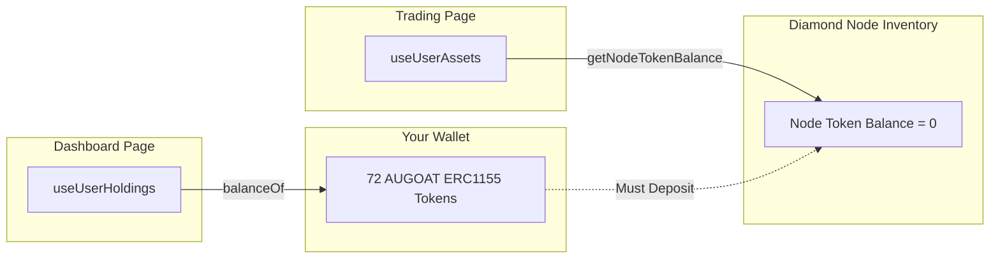
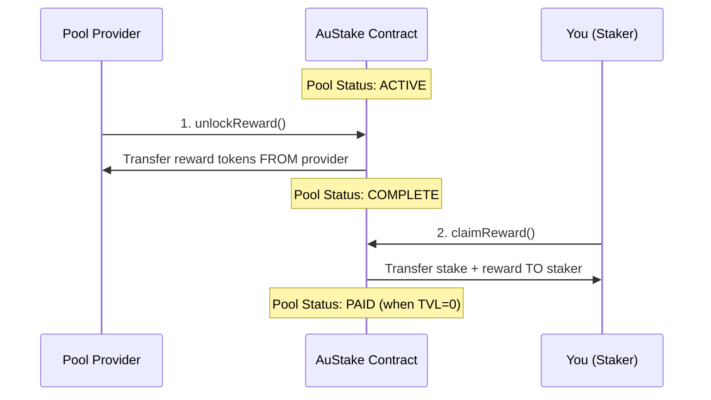

# Asset System Architecture Investigation and Fixes

## Summary of Issues Found

I've identified three distinct issues stemming from architectural inconsistencies in how assets and tokens are managed across the application.---

## Issue 1: Asset Discrepancy (Dashboard vs Trading)

### Root Cause

The application uses **two different data sources** for displaying user assets:| Screen | Data Source | What It Shows ||--------|-------------|---------------|| Dashboard | `useUserHoldings` hook | ERC1155 tokens in wallet (`balanceOf`) || Trading | `useUserAssets` hook | Assets in node inventory (`getNodeTokenBalance`) |The dashboard shows 72 AUGOAT because you **own** those ERC1155 tokens in your wallet. The trading screen shows "No assets" because those tokens haven't been **deposited into a node** yet.

### Data Flow Diagram



### Fix Required

To sell assets on the CLOB, tokens must first be deposited from wallet into node inventory. The trading screen already has a `DepositForTradingModal` component for this, but it only shows when you **try** to place a sell order.**Proposed Solution**: Show the deposit option proactively when user has wallet balance but no node balance.**Files to modify:**

- [`app/components/trading/trade-panel.tsx`](app/components/trading/trade-panel.tsx) - Show "Deposit first" prompt when wallet has tokens but node doesn't
- [`hooks/useUserAssets.ts`](hooks/useUserAssets.ts) - Add wallet balance check alongside node balance

---

## Issue 2: Staking Without Owning Assets

### Root Cause

The staking system uses **ERC20 AURA tokens**, NOT the ERC1155 AUGOAT asset tokens.Looking at the add-liquidity page:

```149:app/customer/pools/[id]/add-liquidity/page.tsx
      await stake(pool.id, totalAmount);
```

The `totalAmount` is calculated as a **dollar/AURA value**, not goat units. The pool.service.ts confirms this:

```122:156:infrastructure/services/pool.service.ts
// Shows stake() handles ERC20 token transfers
async stake(
  poolId: string,
  amount: BigNumberString,
  investorAddress: Address,
): Promise<string> {
  // ...
  const amountInWei = ethers.parseEther(amount);
  // ...
  const tokenAddress = operation.token; // This is an ERC20 address
  await this.handleTokenApproval(tokenAddress, amountInWei.toString());
  // ...
}
```

And the AuStake contract:

```159:196:contracts/AuStake.sol
function stake(
  address token,      // ERC20 token address
  bytes32 operationId,
  uint256 amount
) external nonReentrant {
  // ...
  IERC20 tokenContract = IERC20(token);  // ERC20, not ERC1155!
  require(
    tokenContract.transferFrom(msg.sender, address(this), amount),
    'Transfer failed'
  );
  // ...
}
```

**You were able to stake because you had AURA ERC20 tokens in your wallet - the staking pool accepts AURA tokens as liquidity, not the physical AUGOAT asset tokens.**

### Fix Required

The UI is misleading. The add-liquidity page shows "Asset" information but actually stakes AURA tokens.**Proposed Solution**: Clarify the UI to show that users are staking AURA tokens, not the physical asset tokens.**Files to modify:**

- [`app/customer/pools/[id]/add-liquidity/page.tsx`](app/customer/pools/[id]/add-liquidity/page.tsx) - Clarify that this is AURA token staking, not asset staking

---

## Issue 3: Claim Reward Shows Success But Nothing Happens

### Root Cause

The reward claiming has a **two-step process** that isn't being followed:



Looking at the contract:

```228:247:contracts/AuStake.sol
function unlockReward(address token, bytes32 operationId) public {
  require(
    idToOperation[operationId].provider == msg.sender,
    'sender is not the provider'
  );
  // ...
  operation.operationStatus = OperationStatus.COMPLETE;
  require(
    tokenContract.transferFrom(msg.sender, address(this), totalRewardsNeeded),
    'Reward transfer failed'
  );
}
```

And claimReward requires COMPLETE status:

```252:261:contracts/AuStake.sol
function claimReward(
  address token,
  bytes32 operationId,
  address user
) external {
  // ...
  require(
    idToOperation[operationId].operationStatus == OperationStatus.COMPLETE,
    'Operation not complete'
  );
  // ...
}
```

The UI shows "Reward claimed successfully" but:

1. If the pool is still ACTIVE, the transaction reverts
2. The toast message might be shown before the transaction is confirmed
3. The two transactions you signed were likely: approval + claim attempt (which reverted)

Looking at the claim handler:

```220:271:app/customer/pools/[id]/page.tsx
const handleRewardClaim = async () => {
  // ...
  if (pool.status === PoolStatus.COMPLETE) {
    await claimReward(pool.id);
    toast({ title: 'Success', description: 'Reward claimed successfully' });
    return;
  }
  // For providers only when ACTIVE:
  if (isProvider && pool.status === PoolStatus.ACTIVE) {
    await unlockReward(pool.id);
    // ...
  }
  // ...
}
```

**The issue**: If you're not the provider and the pool is ACTIVE, the claim does nothing useful but might still show a success message due to improper error handling.

### Fix Required

**Proposed Solutions:**

1. Add proper status checking before showing success toast
2. Show clearer error when pool isn't ready for claiming
