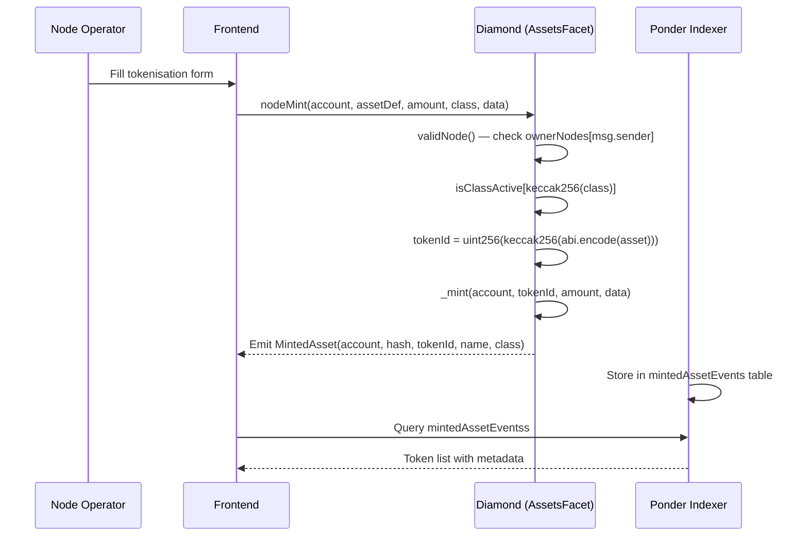
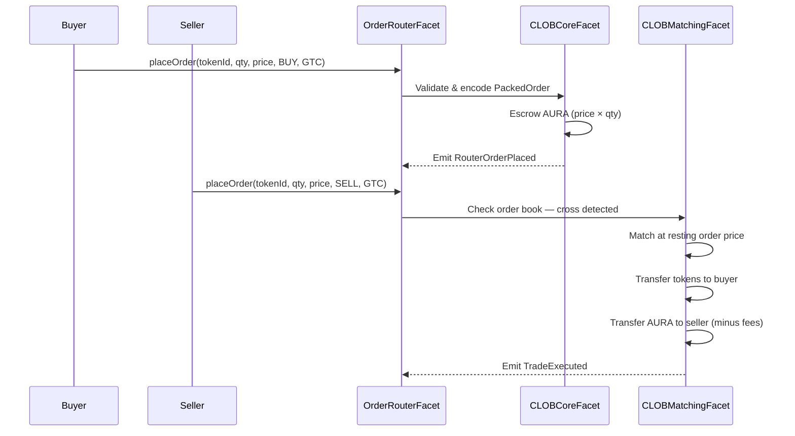
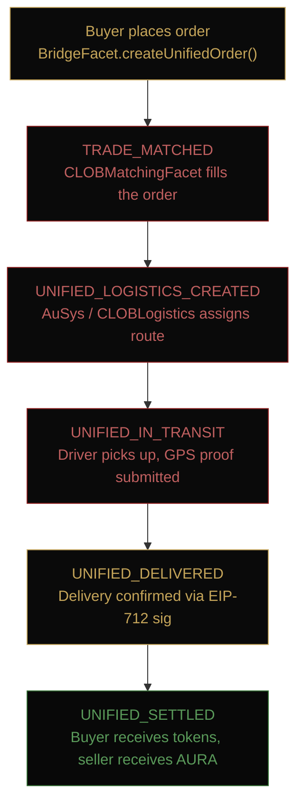
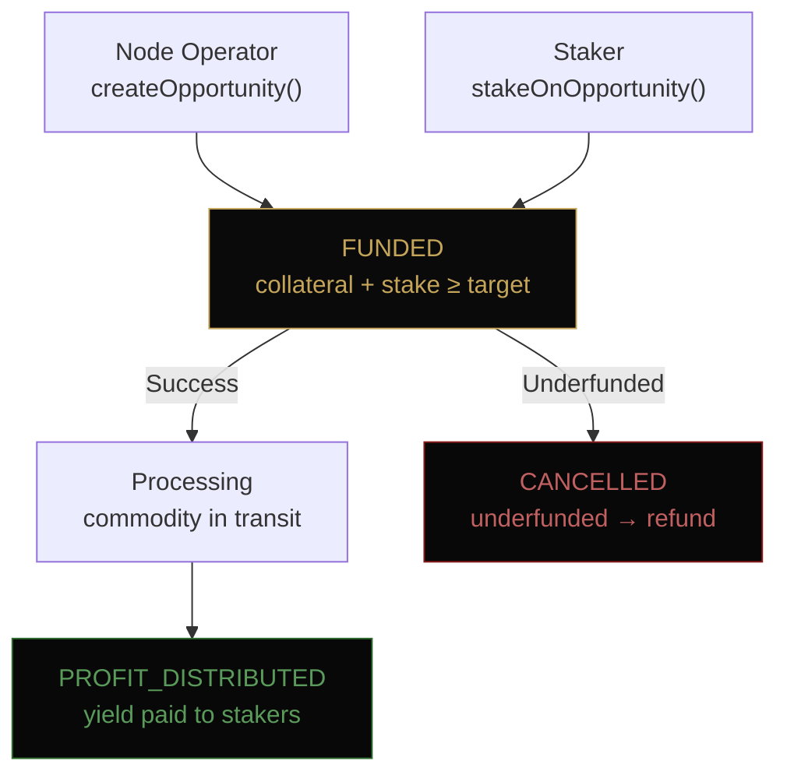

# Data Flow

[[🏠 Home]] > Architecture > Data Flow

Four primary data flows drive the Aurellion protocol. Each starts at the frontend, passes through smart contracts, emits events, gets indexed by Ponder, and is read back by the frontend.

---

## 1 — Asset Tokenisation Flow

---

## 2 — CLOB Order Matching Flow

---

## 3 — Unified Order (Bridge + Logistics) Flow

---

## 4 — RWY Staking Flow

---

## Event → Database Mapping

| Event                  | Emitter           | Ponder Table                  |
| ---------------------- | ----------------- | ----------------------------- |
| `MintedAsset`          | AssetsFacet       | `mintedAssetEventss`          |
| `RouterOrderPlaced`    | OrderRouterFacet  | `routerOrderPlacedEventss`    |
| `TradeExecuted`        | CLOBMatchingFacet | `tradeExecutedEventss`        |
| `UnifiedOrderCreated`  | BridgeFacet       | `unifiedOrderCreatedEventss`  |
| `JourneyStatusUpdated` | AuSysFacet        | `journeyStatusUpdatedEventss` |
| `OpportunityCreated`   | RWYStakingFacet   | `opportunityCreatedEventss`   |
| `ProfitDistributed`    | RWYStakingFacet   | `profitDistributedEventss`    |

---

## Related Pages

- [[Architecture/System Overview]]
- [[Architecture/Indexer Architecture]]
- [[Core Concepts/Order Lifecycle]]
- [[Core Concepts/Journey and Logistics]]
