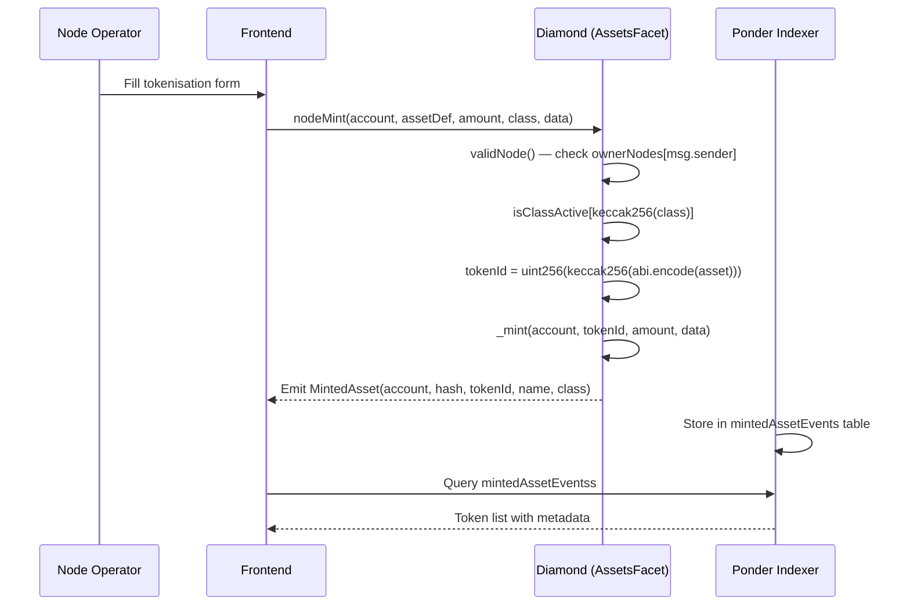
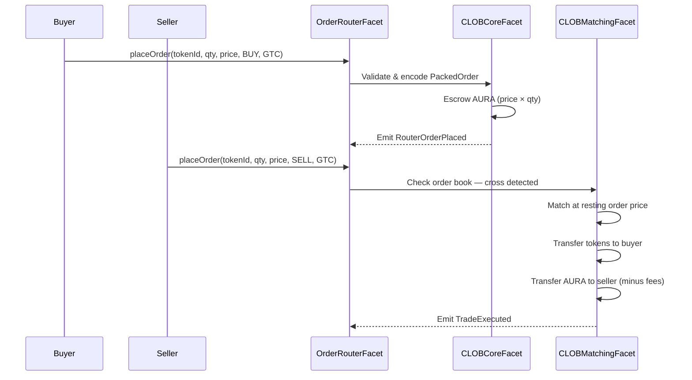

# Data Flow

[[🏠 Home]] > Architecture > Data Flow

Four primary data flows drive the Aurellion protocol. Each starts at the frontend, passes through smart contracts, emits events, gets indexed by Ponder, and is read back by the frontend.

---

## 1 — Asset Tokenisation Flow



---

## 2 — CLOB Order Matching Flow



---

## 3 — Unified Order (Bridge + Logistics) Flow

```
BridgeFacet.createUnifiedOrder()
│
│  Buyer submits order — AURA escrowed
▼
TRADE_MATCHED
│
│  CLOBMatchingFacet fills the order at resting price
▼
UNIFIED_LOGISTICS_CREATED
│
│  AuSys assigns route — nodes selected, driver dispatched
▼
UNIFIED_IN_TRANSIT
│
│  Driver picks up physical commodity — GPS proof submitted
▼
UNIFIED_DELIVERED
│
│  EIP-712 signed delivery confirmation verified on-chain
▼
UNIFIED_SETTLED
   Buyer receives ERC-1155 tokens
   Seller receives AURA (minus fees)
```

---

## 4 — RWY Staking Flow

```
createOpportunity()  +  stakeOnOpportunity()
│                        │
│  Operator puts up       │  Stakers add yield capital
│  ≥20% collateral        │  up to promisedYieldBps cap
└────────────────┬────────┘
                 │
                 ▼
             FUNDED
             collateral + stakes ≥ target amount
             │                        │
             │ Operator starts         │ Deadline passes
             │ commodity journey       │ underfunded
             ▼                        ▼
         PROCESSING               CANCELLED
         in transit               all funds refunded
             │
             ▼
     PROFIT_DISTRIBUTED
     ├── Operator receives commodity sale proceeds
     ├── Stakers receive promisedYield (pro-rata)
     └── Protocol takes 1% fee
```

---

## Event → Database Mapping

| Event                  | Emitter           | Ponder Table                  |
| ---------------------- | ----------------- | ----------------------------- |
| `MintedAsset`          | AssetsFacet       | `mintedAssetEventss`          |
| `RouterOrderPlaced`    | OrderRouterFacet  | `routerOrderPlacedEventss`    |
| `TradeExecuted`        | CLOBMatchingFacet | `tradeExecutedEventss`        |
| `UnifiedOrderCreated`  | BridgeFacet       | `unifiedOrderCreatedEventss`  |
| `JourneyStatusUpdated` | AuSysFacet        | `journeyStatusUpdatedEventss` |
| `OpportunityCreated`   | RWYStakingFacet   | `opportunityCreatedEventss`   |
| `ProfitDistributed`    | RWYStakingFacet   | `profitDistributedEventss`    |

---

## Related Pages

- [[Architecture/System Overview]]
- [[Architecture/Indexer Architecture]]
- [[Core Concepts/Order Lifecycle]]
- [[Core Concepts/Journey and Logistics]]
