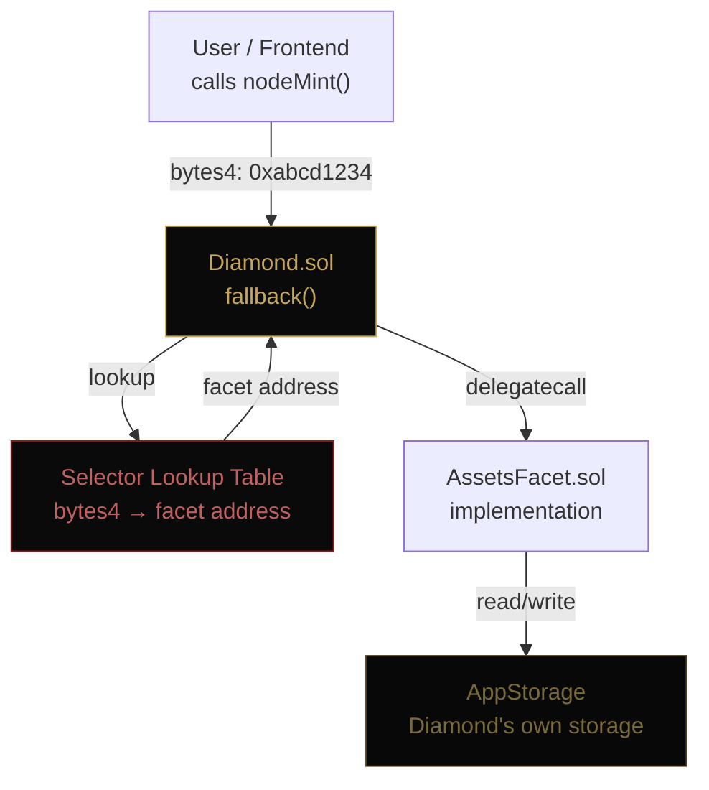
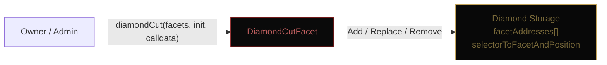

# Diamond Proxy Pattern

[[🏠 Home]] > Architecture > Diamond Proxy Pattern

Aurellion's smart contract system implements **EIP-2535 Diamond Standard** — a single proxy address that delegates calls to modular, upgradeable implementation contracts called _facets_.

---

## Why Diamond?

| Problem                               | Diamond Solution                          |
| ------------------------------------- | ----------------------------------------- |
| Contract size limit (24 KB)           | Logic split across unlimited facets       |
| Upgrade requires new address          | One address forever, swap facets          |
| Separate contracts need separate ABIs | One ABI, one address                      |
| Storage conflicts on upgrade          | Shared `AppStorage` struct, no collisions |

---

## How a Call Routes



> **Key insight:** `delegatecall` means the facet's code runs in the Diamond's storage context. The facet address is just bytecode — state lives in the Diamond forever.

---

## DiamondCut: Adding / Replacing Facets



Three operations:

| Action    | Effect                                        |
| --------- | --------------------------------------------- |
| `Add`     | Register new selectors → new facet address    |
| `Replace` | Point existing selectors → new implementation |
| `Remove`  | Delete selectors (function disabled)          |

---

## Deployed Facets

| #   | Facet                | Address       | Block    |
| --- | -------------------- | ------------- | -------- |
| 1   | DiamondCutFacet      | `0xf20eBBF5…` | 37798347 |
| 2   | DiamondLoupeFacet    | `0x63a67381…` | 37798349 |
| 3   | OwnershipFacet       | `0x03fc08c2…` | 37798351 |
| 4   | ERC1155ReceiverFacet | `0xFDb90E10…` | 37798353 |
| 5   | RWYStakingFacet      | `0xa695B719…` | 37798363 |
| 6   | OperatorFacet        | `0x37e5d45e…` | 37798365 |
| 7   | BridgeFacet          | `0x83365e0d…` | 37798367 |
| 8   | CLOBFacet (view)     | `0x76235E51…` | 37798370 |
| 9   | OrderRouterFacet     | `0x2bd1D7DC…` | 37798373 |
| 10  | AssetsFacet          | `0x73755152…` | 37798436 |
| 11  | NodesFacet           | `0xc23eB03C…` | 37798451 |
| 12  | AuSysFacet           | `0xCA6e4044…` | 37885943 |
| 13  | CLOBLogisticsFacet   | `0x66fD1A58…` | 38304361 |

---

## Storage Layout

All facets share a single `AppStorage` struct accessed via a fixed storage slot:

```solidity
// DiamondStorage.sol
bytes32 constant APP_STORAGE_POSITION =
    keccak256("aurellion.app.storage");

function appStorage() internal pure returns (AppStorage storage s) {
    bytes32 pos = APP_STORAGE_POSITION;
    assembly { s.slot := pos }
}
```

This prevents storage collisions between facets. See [[Smart Contracts/Libraries/DiamondStorage]] for the full struct layout.

---

## Related Pages

- [[Architecture/System Overview]]
- [[Smart Contracts/Overview]]
- [[Smart Contracts/Libraries/DiamondStorage]]
- [[Technical Reference/Upgrading Facets]]
