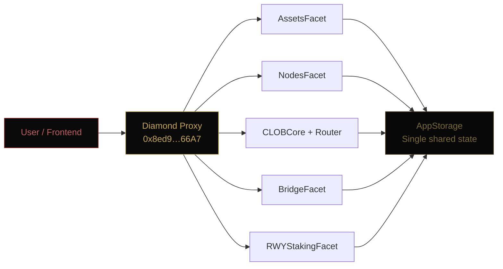
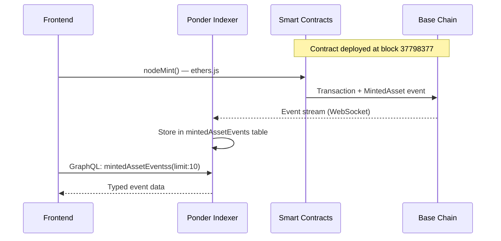

# System Overview

[[🏠 Home]] > Architecture > System Overview

Aurellion is a **four-layer protocol** for tokenising and trading real-world assets on Base. Each layer has a clear responsibility and communicates with adjacent layers through well-defined interfaces.

---

## Four-Layer Stack

```
┌─────────────────────────────────────────┐
│           FRONTEND LAYER                │
│  Next.js 14 · Privy · ethers.js         │
│  Customer UI · Node UI · Driver UI      │
└──────────────┬──────────────────────────┘
               │ GraphQL queries          │ ethers.js calls
               ▼                          ▼
┌──────────────────────────┐   ┌──────────────────────────┐
│   INFRASTRUCTURE LAYER   │   │  SMART CONTRACT LAYER    │
│  Ponder Indexer          │◄──│  Diamond Proxy EIP-2535  │
│  PostgreSQL 16           │   │  13 Facets · AppStorage  │
│  Repository + Services   │   └────────────┬─────────────┘
└──────────────────────────┘                │ state + events
                                            ▼
                            ┌──────────────────────────────┐
                            │       BASE BLOCKCHAIN        │
                            │  Base Sepolia · Chain 84532  │
                            │  ~2s block time              │
                            └──────────────────────────────┘
```

---

## Component Responsibilities

### Frontend Layer

| Component               | Purpose                                    |
| ----------------------- | ------------------------------------------ |
| Next.js App Router      | SSR/SSG, routing, page rendering           |
| Privy                   | Wallet connection, embedded wallets, auth  |
| ethers.js               | Contract interaction, transaction signing  |
| React Context Providers | Global state — nodes, orders, pools, trade |
| graphql-request         | Queries to Ponder indexer                  |

### Infrastructure Layer

| Component          | Purpose                                         |
| ------------------ | ----------------------------------------------- |
| Ponder Indexer     | Streams events from Base → stores in PostgreSQL |
| PostgreSQL 16      | Persistent event store, queried via GraphQL     |
| Repository Pattern | Aggregates raw events into domain state         |
| Services Layer     | Business logic: routing, pricing, matching      |

### Smart Contract Layer

All contracts operate through a single **Diamond proxy** at `0x8ed92Ff64dC6e833182a4743124FE3e48E2966A7`. Facets are stateless — all state lives in `AppStorage` inside the Diamond.



---

## Inter-Layer Data Flow



---

## Deployment Environment

| Property        | Value                                        |
| --------------- | -------------------------------------------- |
| Network         | Base Sepolia (testnet)                       |
| Chain ID        | `84532`                                      |
| Block time      | ~2 seconds                                   |
| Diamond address | `0x8ed92Ff64dC6e833182a4743124FE3e48E2966A7` |
| Deploy block    | `37798377`                                   |
| Indexer         | `https://indexer.aurellionlabs.com/graphql`  |
| Frontend        | Next.js 14 / App Router                      |
| Indexer runtime | Docker (Bun + PostgreSQL 16)                 |
| Package manager | Bun 1.2.8                                    |

---

## Related Pages

- [[Architecture/Diamond Proxy Pattern]]
- [[Architecture/Data Flow]]
- [[Architecture/Indexer Architecture]]
- [[Smart Contracts/Overview]]
